# Cheat sheet – Design Patterns (GoF)

## 1. Vue d'ensemble

Les 23 patterns du « Gang of Four » se rangent en 3 familles :

| Famille | Question résolue | Patterns |
|---|---|---|
| **Création** | *Comment créer les objets ?* | Singleton, Factory Method, Abstract Factory, Builder, Prototype |
| **Structure** | *Comment assembler les objets ?* | Adapter, Bridge, Composite, Decorator, Facade, Flyweight, Proxy |
| **Comportement** | *Comment les objets communiquent / se répartissent les responsabilités ?* | Chain of Responsibility, Command, Iterator, Mediator, Memento, Observer, State, Strategy, Template Method, Visitor, Interpreter |

**Bonus :** MVC, qui n'est pas un pattern GoF mais un pattern d'**architecture** (voir §5).

> Mnémo : **Création = new**, **Structure = composition de classes**, **Comportement = algorithmes & messages**

### ⭐ Au programme de l'exam

Le prof a dit de savoir **faire** (diagramme de classes + code) : **MVC**, **Singleton**, **Observer**, **Command**, **Builder**, **Abstract Factory**, **State** et **Strategy**. Ils sont marqués ⭐ dans la suite.
Le §6 reprend l'**exercice de révision ON/OFF** : MVC + Observer + Command, puis la version State (+ Singleton).

### Les 2 principes derrière presque tous les patterns

1. **Programmer vers une interface**, pas vers une implémentation.
2. **Préférer la composition à l'héritage.**

### Légende des diagrammes

(Détails dans [uml-cheatsheet.md](uml-cheatsheet.md).)

| Flèche | Sens | En Java |
|---|---|---|
| `A ──▷ B` trait plein + triangle vide | A **hérite** de B | `class A extends B` |
| `A - -▷ B` pointillé + triangle vide | A **implémente** B | `class A implements B` |
| `A ◇── B` losange vide côté A | A **a un attribut** de type B (agrégation) | `private B b;` reçu de l'extérieur |
| `A ◆── B` losange plein côté A | A **possède** B, B meurt avec A (composition) | `private B b = new B();` |
| `A ──> B` trait plein + flèche | A **connaît** B (garde une référence) | attribut de type B |
| `A - -> B` pointillé + flèche | A **utilise ou crée** B ponctuellement | `new B()` ou paramètre |

- `<<interface>>` / `<<abstract>>` au-dessus du nom = interface / classe abstraite
- méthode en *italique* = abstraite, méthode soulignée = `static`
- `+` public, `-` privé, `#` protégé

> **Astuce de lecture :** repère d'abord l'**interface** (en haut), puis **qui l'implémente**, puis **qui la contient** (◇). Le cœur du pattern est presque toujours là.

---

## 2. Patterns de création

### Singleton ⭐
**But :** une seule instance, accessible globalement.
**✅ Utiliser si :** config, logger, pool de connexions.
**❌ Éviter si :** tu as besoin de tester facilement ou d'avoir plusieurs configurations : l'injection de dépendances fait mieux.

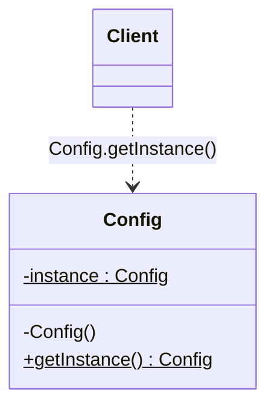
```mermaid
classDiagram
    class Config {
        -instance : Config$
        -Config()
        +getInstance() Config$
    }
    class Client
    Client ..> Config : Config.getInstance()
```

🔎 **Lecture :** le constructeur est **privé** (`-`), donc personne ne peut faire `new Config()`. La seule instance est rangée dans l'attribut **static** (souligné) et on la récupère par `getInstance()`.

```java
public final class Config {
    private static final Config INSTANCE = new Config();
    private Config() {}                          // constructeur privé
    public static Config getInstance() { return INSTANCE; }
}
```

### Factory Method
**But :** laisser les sous-classes décider quelle classe concrète instancier.
**✅ Utiliser si :** le code client ne doit pas connaître le type exact créé.
**❌ Éviter si :** il n'y a qu'un seul type de produit et aucune raison qu'il change : un simple `new` suffit.

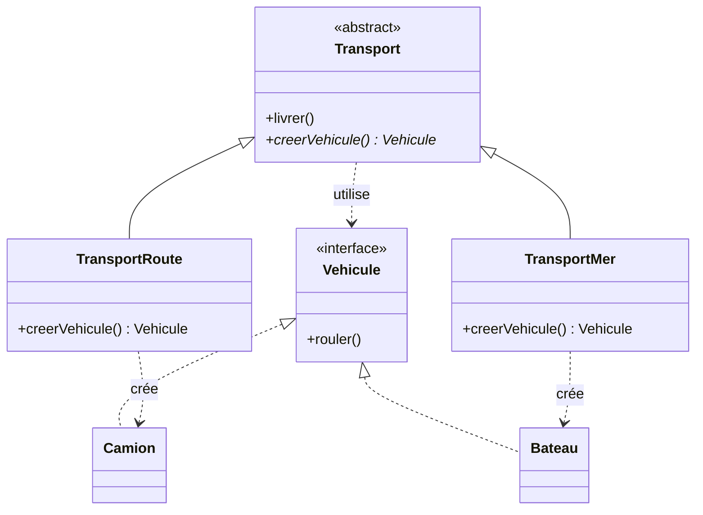
```mermaid
classDiagram
    class Transport {
        <<abstract>>
        +livrer()
        +creerVehicule() Vehicule*
    }
    class TransportRoute {
        +creerVehicule() Vehicule
    }
    class TransportMer {
        +creerVehicule() Vehicule
    }
    class Vehicule {
        <<interface>>
        +rouler()
    }
    Transport <|-- TransportRoute
    Transport <|-- TransportMer
    Vehicule <|.. Camion
    Vehicule <|.. Bateau
    Transport ..> Vehicule : utilise
    TransportRoute ..> Camion : crée
    TransportMer ..> Bateau : crée
```

🔎 **Lecture :** il y a deux hiérarchies en parallèle : les **créateurs** (`Transport…`) et les **produits** (`Vehicule`, `Camion`, `Bateau`). `Transport.livrer()` ne manipule que l'interface `Vehicule`. C'est chaque sous-classe qui choisit le `new` en redéfinissant `creerVehicule()`, la « factory method » (en italique car abstraite).

```java
abstract class Transport {
    abstract Vehicule creerVehicule();           // la "factory method"
    void livrer() { creerVehicule().rouler(); }
}
class TransportRoute extends Transport {
    Vehicule creerVehicule() { return new Camion(); }
}
```

### Abstract Factory ⭐
**But :** créer des **familles** d'objets liés sans préciser leurs classes concrètes.
**✅ Utiliser si :** thèmes UI (Windows/Mac), drivers BDD (MySQL/Postgres).
**❌ Éviter si :** tu n'as qu'une seule famille de produits : c'est beaucoup d'interfaces pour rien.
**Diff. avec Factory Method :** une *méthode* qui crée *un* produit vs un *objet* qui crée *plusieurs* produits cohérents.

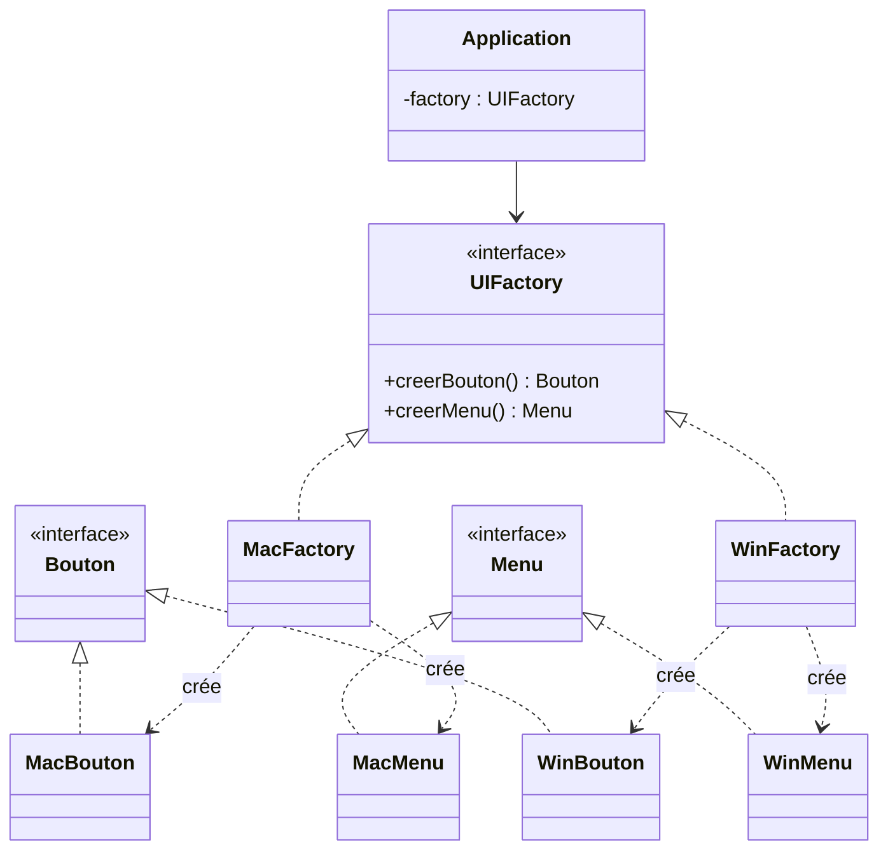
```mermaid
classDiagram
    class UIFactory {
        <<interface>>
        +creerBouton() Bouton
        +creerMenu() Menu
    }
    class Bouton {
        <<interface>>
    }
    class Menu {
        <<interface>>
    }
    class Application {
        -factory : UIFactory
    }
    Application --> UIFactory
    UIFactory <|.. MacFactory
    UIFactory <|.. WinFactory
    Bouton <|.. MacBouton
    Bouton <|.. WinBouton
    Menu <|.. MacMenu
    Menu <|.. WinMenu
    MacFactory ..> MacBouton : crée
    MacFactory ..> MacMenu : crée
    WinFactory ..> WinBouton : crée
    WinFactory ..> WinMenu : crée
```

🔎 **Lecture :** suis les flèches « crée » : `MacFactory` ne crée que des objets `Mac…`, et `WinFactory` que des `Win…`. `Application` ne connaît que les 3 interfaces. On change tout le thème en changeant une seule factory.

```java
interface UIFactory { Bouton creerBouton(); Menu creerMenu(); }
class MacFactory implements UIFactory {
    public Bouton creerBouton() { return new MacBouton(); }
    public Menu creerMenu()     { return new MacMenu(); }
}
```

### Builder ⭐
**But :** construire un objet complexe étape par étape.
**✅ Utiliser si :** beaucoup de paramètres optionnels (évite le « constructeur télescopique »).
**❌ Éviter si :** l'objet a 2-3 paramètres obligatoires : un constructeur classique est plus lisible.

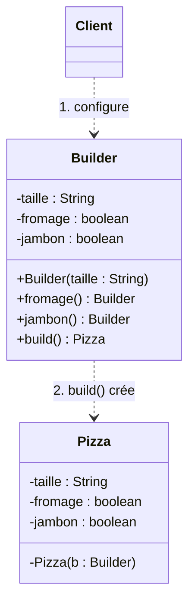
```mermaid
classDiagram
    class Pizza {
        -taille : String
        -fromage : boolean
        -jambon : boolean
        -Pizza(b : Builder)
    }
    class Builder {
        -taille : String
        -fromage : boolean
        -jambon : boolean
        +Builder(taille : String)
        +fromage() Builder
        +jambon() Builder
        +build() Pizza
    }
    class Client
    Client ..> Builder : 1. configure
    Builder ..> Pizza : 2. build() crée
```

🔎 **Lecture :** le `Builder` a **les mêmes attributs** que `Pizza`, qu'il remplit petit à petit. Chaque méthode **retourne le Builder** (`this`), ce qui permet de chaîner les appels. Le constructeur de `Pizza` est privé : on ne peut obtenir une pizza qu'en passant par `build()`.

```java
Pizza p = new Pizza.Builder("grande")
        .fromage()
        .jambon()
        .build();
```

### Prototype
**But :** créer un objet en **clonant** un existant.
**✅ Utiliser si :** création coûteuse, ou type inconnu à la compilation.
**❌ Éviter si :** les objets contiennent des références circulaires ou des ressources (connexions, fichiers) difficiles à cloner proprement.

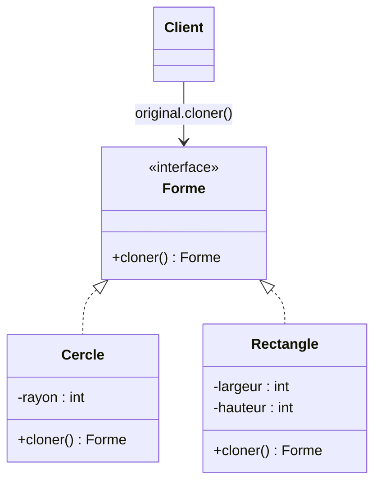
```mermaid
classDiagram
    class Forme {
        <<interface>>
        +cloner() Forme
    }
    class Cercle {
        -rayon : int
        +cloner() Forme
    }
    class Rectangle {
        -largeur : int
        -hauteur : int
        +cloner() Forme
    }
    class Client
    Forme <|.. Cercle
    Forme <|.. Rectangle
    Client --> Forme : original.cloner()
```

🔎 **Lecture :** le client ne connaît que `Forme` et appelle `cloner()` sans savoir si c'est un cercle ou un rectangle. Chaque classe sait se recopier elle-même (`return new Cercle(this)`).

```java
interface Forme extends Cloneable { Forme cloner(); }
Forme copie = original.cloner();
```

---

## 3. Patterns de structure

### Adapter
**But :** rendre compatible une interface existante avec celle attendue.
**✅ Utiliser si :** tu dois intégrer une classe existante (legacy, lib externe) dont l'interface ne correspond pas à celle attendue.
**❌ Éviter si :** tu peux modifier directement la classe source : l'adapter ajoute juste une couche inutile.
**Image :** l'adaptateur de prise électrique.

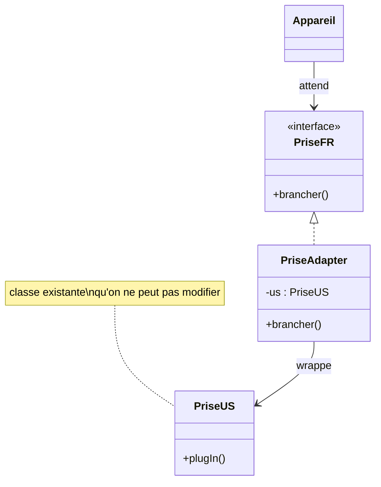
```mermaid
classDiagram
    class Appareil
    class PriseFR {
        <<interface>>
        +brancher()
    }
    class PriseAdapter {
        -us : PriseUS
        +brancher()
    }
    class PriseUS {
        +plugIn()
    }
    Appareil --> PriseFR : attend
    PriseFR <|.. PriseAdapter
    PriseAdapter --> PriseUS : wrappe
    note for PriseUS "classe existante\nqu'on ne peut pas modifier"
```

🔎 **Lecture :** en suivant les flèches, `Appareil` veut une `PriseFR`. `PriseAdapter` **est** une `PriseFR` (il l'implémente) et **contient** une `PriseUS`. Son `brancher()` appelle juste `us.plugIn()` : il ne fait que traduire l'appel.

```java
class PriseAdapter implements PriseFR {
    private final PriseUS us;
    PriseAdapter(PriseUS us) { this.us = us; }
    public void brancher() { us.plugIn(); }      // traduction d'appel
}
```

### Bridge
**But :** séparer une **abstraction** de son **implémentation** pour les faire varier indépendamment.
**✅ Utiliser si :** explosion combinatoire de sous-classes (Forme × Couleur, Télécommande × Appareil).
**❌ Éviter si :** tu n'as qu'une seule dimension qui varie : l'héritage simple suffit.

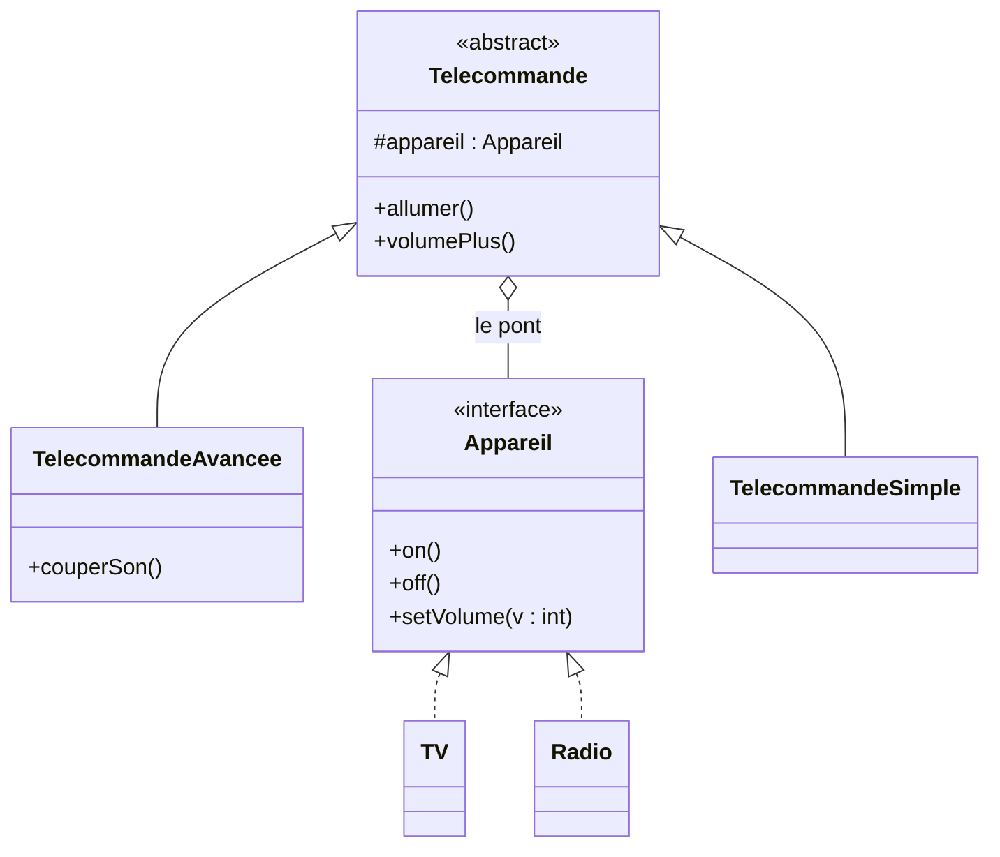
```mermaid
classDiagram
    class Telecommande {
        <<abstract>>
        #appareil : Appareil
        +allumer()
        +volumePlus()
    }
    class TelecommandeAvancee {
        +couperSon()
    }
    class Appareil {
        <<interface>>
        +on()
        +off()
        +setVolume(v : int)
    }
    Telecommande <|-- TelecommandeSimple
    Telecommande <|-- TelecommandeAvancee
    Telecommande o-- Appareil : le pont
    Appareil <|.. TV
    Appareil <|.. Radio
```

🔎 **Lecture :** le diagramme a **deux hiérarchies indépendantes**, les télécommandes d'un côté et les appareils de l'autre, reliées par **un seul lien ◇** : c'est le « pont ». Sans lui, il faudrait `TelecommandeSimpleTV`, `TelecommandeSimpleRadio`, `TelecommandeAvanceeTV`… soit une classe par combinaison. Avec lui, on ajoute juste une classe d'un côté.

```java
abstract class Telecommande {
    protected Appareil appareil;                 // le "pont"
    Telecommande(Appareil a) { this.appareil = a; }
}
```

### Composite
**But :** traiter uniformément un objet simple et un groupe d'objets (structure en **arbre**).
**✅ Utiliser si :** fichiers/dossiers, éléments graphiques, menus.
**❌ Éviter si :** ta structure n'est pas vraiment un arbre, ou feuilles et conteneurs ont des comportements trop différents pour partager une interface.

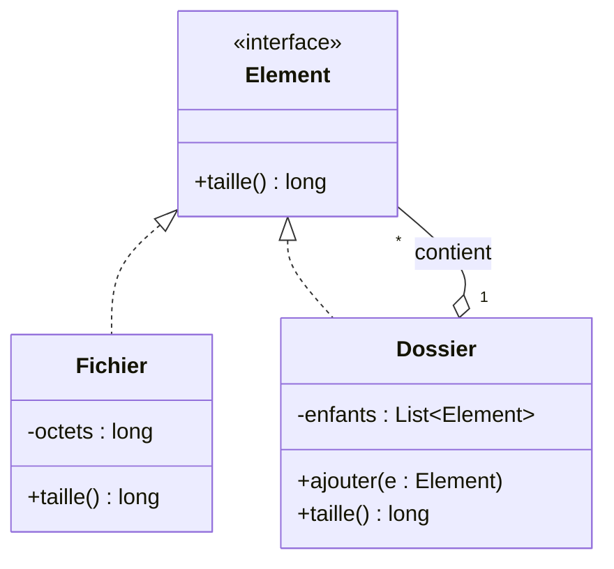
```mermaid
classDiagram
    class Element {
        <<interface>>
        +taille() long
    }
    class Fichier {
        -octets : long
        +taille() long
    }
    class Dossier {
        -enfants : List~Element~
        +ajouter(e : Element)
        +taille() long
    }
    Element <|.. Fichier
    Element <|.. Dossier
    Dossier "1" o-- "*" Element : contient
```

🔎 **Lecture :** le point clé est le losange qui **remonte** de `Dossier` vers `Element`, et non vers `Fichier`. Un dossier contient donc des `Element`, c'est-à-dire des fichiers **ou d'autres dossiers**, d'où l'arbre. `Fichier` est une **feuille** : il n'a pas d'enfants.

```java
class Dossier implements Element {
    private List<Element> enfants = new ArrayList<>();
    public long taille() {
        return enfants.stream().mapToLong(Element::taille).sum();
    }
}
```

### Decorator
**But :** ajouter des responsabilités à un objet **dynamiquement**, sans héritage.
**✅ Utiliser si :** options cumulables (café + lait + sucre), flux Java (`BufferedReader(new FileReader(...))`).
**❌ Éviter si :** l'ordre d'empilement des décorateurs change le résultat de façon piégeuse, ou si tu n'as qu'une seule option fixe.

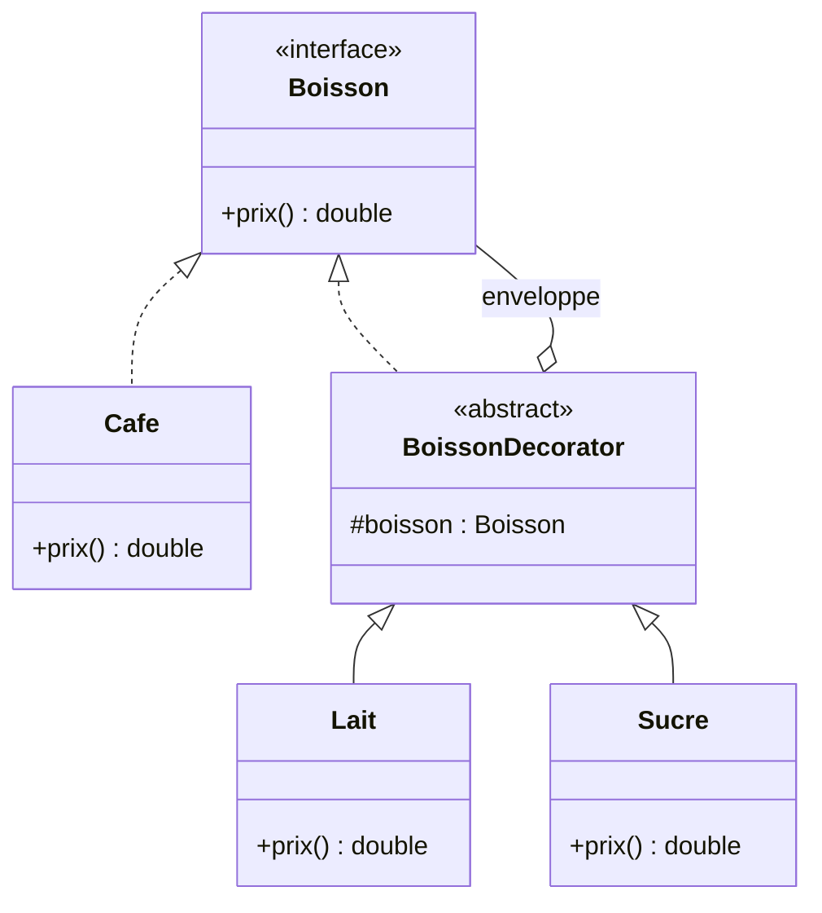
```mermaid
classDiagram
    class Boisson {
        <<interface>>
        +prix() double
    }
    class Cafe {
        +prix() double
    }
    class BoissonDecorator {
        <<abstract>>
        #boisson : Boisson
    }
    class Lait {
        +prix() double
    }
    class Sucre {
        +prix() double
    }
    Boisson <|.. Cafe
    Boisson <|.. BoissonDecorator
    BoissonDecorator o-- Boisson : enveloppe
    BoissonDecorator <|-- Lait
    BoissonDecorator <|-- Sucre
```

🔎 **Lecture :** entre `BoissonDecorator` et `Boisson`, il y a **deux liens**. Le décorateur **est** une `Boisson` (▷) **et a** une `Boisson` (◇). Comme il en est une, on peut le mettre dans un autre décorateur : `new Sucre(new Lait(new Cafe()))`. Chaque `prix()` ajoute son supplément puis appelle celui de la boisson enveloppée.

```java
class Lait extends BoissonDecorator {
    Lait(Boisson b) { super(b); }
    public double prix() { return boisson.prix() + 0.5; }
}
Boisson b = new Sucre(new Lait(new Cafe()));
```

### Facade
**But :** fournir une interface **simple** à un sous-système complexe.
**✅ Utiliser si :** cacher une lib compliquée derrière 2-3 méthodes.
**❌ Éviter si :** elle devient un « god object » qui couple tout le reste de l'appli à elle.

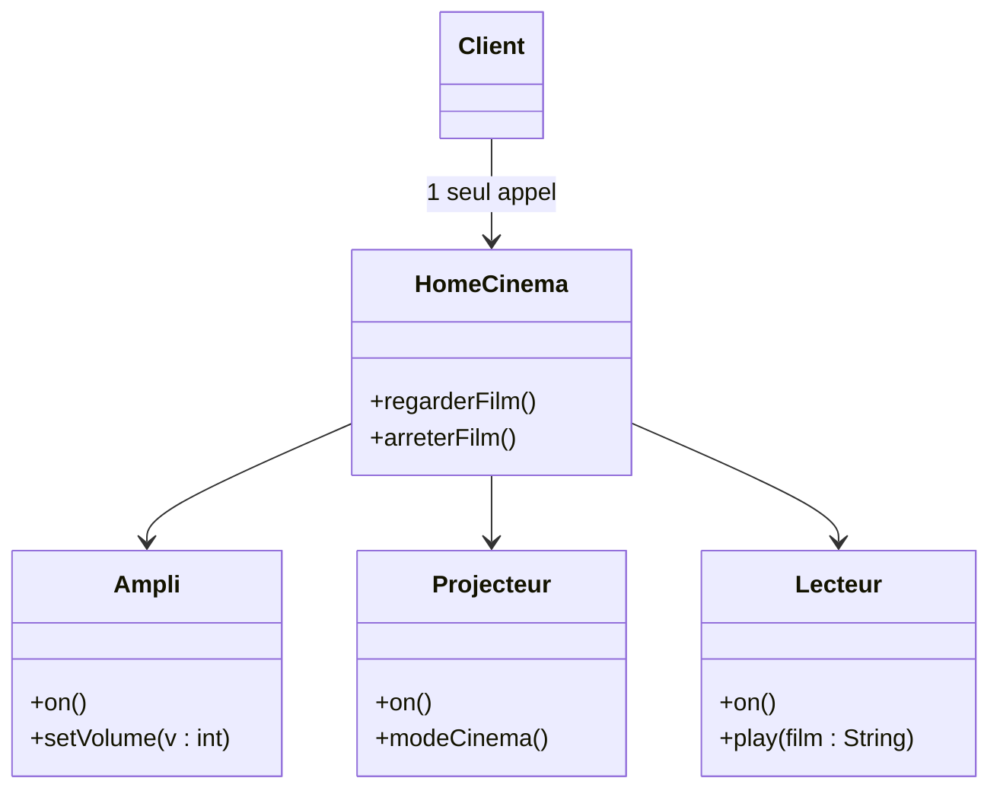
```mermaid
classDiagram
    class Client
    class HomeCinema {
        +regarderFilm()
        +arreterFilm()
    }
    class Ampli {
        +on()
        +setVolume(v : int)
    }
    class Projecteur {
        +on()
        +modeCinema()
    }
    class Lecteur {
        +on()
        +play(film : String)
    }
    Client --> HomeCinema : 1 seul appel
    HomeCinema --> Ampli
    HomeCinema --> Projecteur
    HomeCinema --> Lecteur
```

🔎 **Lecture :** le `Client` n'a **qu'une flèche**, vers la façade. Il ne connaît ni `Ampli`, ni `Projecteur`, ni `Lecteur`. C'est `HomeCinema` qui orchestre les appels dans le bon ordre.

```java
class HomeCinema {
    void regarderFilm() { ampli.on(); projo.on(); lecteur.play(); }
}
```

### Flyweight (poids-mouche)
**But :** partager les parties communes (état **intrinsèque**) entre de nombreux objets pour économiser la mémoire.
**✅ Utiliser si :** caractères d'un éditeur, arbres d'une forêt dans un jeu.
**❌ Éviter si :** tu n'as pas des milliers d'objets : le gain mémoire ne justifie pas la complexité.
**Ex. Java :** `Integer.valueOf()` met en cache -128..127.

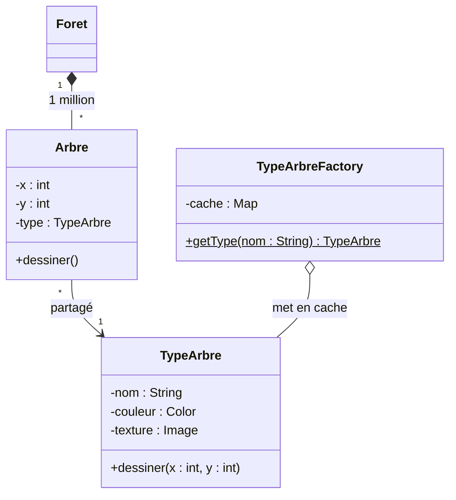
```mermaid
classDiagram
    class Foret
    class Arbre {
        -x : int
        -y : int
        -type : TypeArbre
        +dessiner()
    }
    class TypeArbre {
        -nom : String
        -couleur : Color
        -texture : Image
        +dessiner(x : int, y : int)
    }
    class TypeArbreFactory {
        -cache : Map
        +getType(nom : String) TypeArbre$
    }
    Foret "1" *-- "*" Arbre : 1 million
    Arbre "*" --> "1" TypeArbre : partagé
    TypeArbreFactory o-- TypeArbre : met en cache
```

🔎 **Lecture :** regarde les **cardinalités** : un million d'`Arbre` (`*`) pointent vers **un seul** `TypeArbre` (`1`). Chaque `Arbre` est léger (sa position, l'état **extrinsèque**). La partie lourde, texture et couleur (l'état **intrinsèque**), n'existe qu'en quelques exemplaires, fournis par la factory qui les met en cache.

### Proxy
**But :** un substitut qui contrôle l'accès à un autre objet.
**✅ Utiliser si :** tu veux ajouter un contrôle (lazy loading, droits, cache, log) devant un objet sans que le client s'en rende compte.
**❌ Éviter si :** il n'y a aucun contrôle à ajouter : ça rajoute de la latence et de l'indirection.
**Variantes :** virtuel (lazy loading), protection (droits), distant (RMI), cache.
**Diff. avec Decorator :** même structure, mais le Proxy **contrôle l'accès**, le Decorator **ajoute du comportement**.

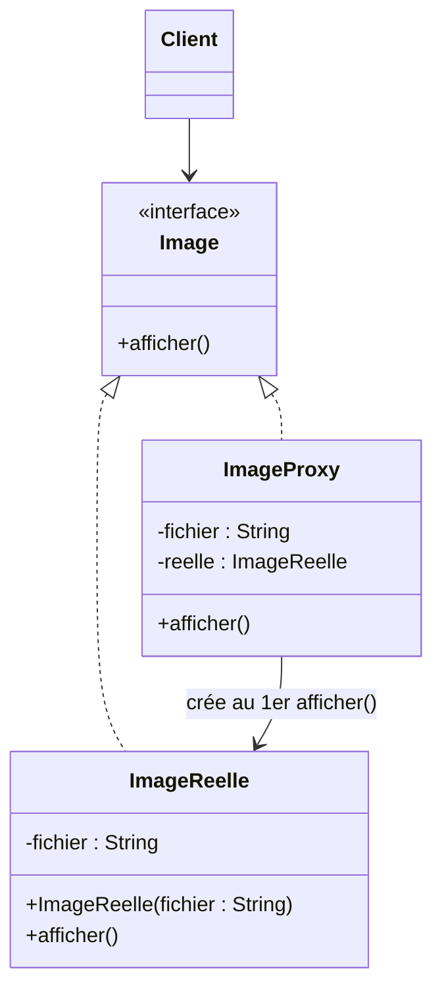
```mermaid
classDiagram
    class Client
    class Image {
        <<interface>>
        +afficher()
    }
    class ImageReelle {
        -fichier : String
        +ImageReelle(fichier : String)
        +afficher()
    }
    class ImageProxy {
        -fichier : String
        -reelle : ImageReelle
        +afficher()
    }
    Client --> Image
    Image <|.. ImageReelle
    Image <|.. ImageProxy
    ImageProxy --> ImageReelle : crée au 1er afficher()
```

🔎 **Lecture :** le proxy et l'objet réel implémentent **la même interface**, donc le client ne voit pas la différence. Le proxy garde une référence vers l'objet réel et décide **quand** (et **si**) il l'appelle.

```java
class ImageProxy implements Image {
    private ImageReelle reelle;
    public void afficher() {
        if (reelle == null) reelle = new ImageReelle(fichier); // lazy
        reelle.afficher();
    }
}
```

---

## 4. Patterns de comportement

### Strategy ⭐
**But :** encapsuler des algorithmes interchangeables.
**✅ Utiliser si :** plusieurs façons de faire la même chose (tri, paiement, calcul de prix).
**❌ Éviter si :** tu n'as que 2 algos qui ne changent jamais : un `if` ou une lambda suffit.
**Remplace :** les gros `if/else` ou `switch` sur un type.

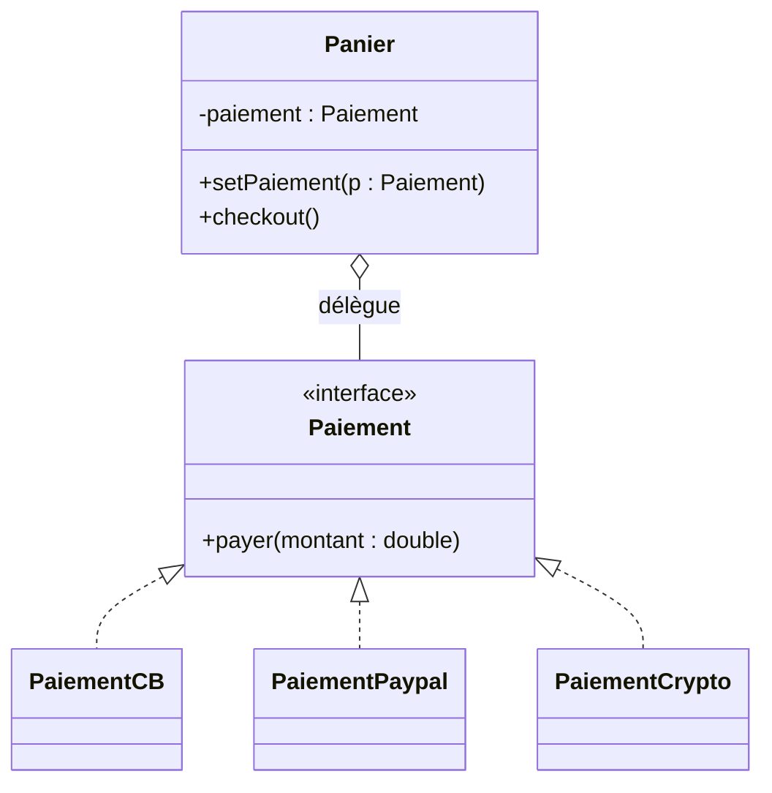
```mermaid
classDiagram
    class Panier {
        -paiement : Paiement
        +setPaiement(p : Paiement)
        +checkout()
    }
    class Paiement {
        <<interface>>
        +payer(montant : double)
    }
    Panier o-- Paiement : délègue
    Paiement <|.. PaiementCB
    Paiement <|.. PaiementPaypal
    Paiement <|.. PaiementCrypto
```

🔎 **Lecture :** `Panier` a un attribut de type **interface** `Paiement` (◇). `checkout()` appelle `paiement.payer()` sans savoir si c'est une CB ou PayPal. Pour changer d'algo, on appelle `setPaiement(...)`, même en cours d'exécution.

```java
interface Paiement { void payer(double montant); }
class Panier {
    private Paiement paiement;
    void setPaiement(Paiement p) { this.paiement = p; }
    void checkout() { paiement.payer(total()); }
}
panier.setPaiement(new PaiementCB());
```

### Observer ⭐
**But :** quand un objet change, ses abonnés sont notifiés automatiquement (relation 1 → N).
**✅ Utiliser si :** événements UI, pub/sub, MVC (modèle → vues).
**❌ Éviter si :** l'ordre des notifications compte, ou si les chaînes de notifications en cascade deviennent impossibles à suivre (et attention aux fuites mémoire si on oublie de se désabonner).

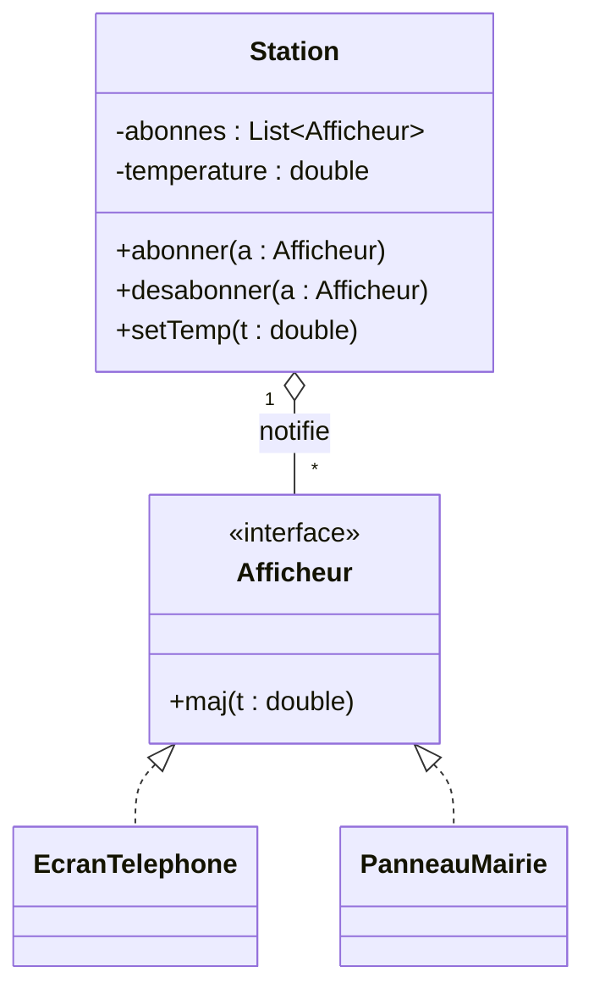
```mermaid
classDiagram
    class Station {
        -abonnes : List~Afficheur~
        -temperature : double
        +abonner(a : Afficheur)
        +desabonner(a : Afficheur)
        +setTemp(t : double)
    }
    class Afficheur {
        <<interface>>
        +maj(t : double)
    }
    Station "1" o-- "*" Afficheur : notifie
    Afficheur <|.. EcranTelephone
    Afficheur <|.. PanneauMairie
```

🔎 **Lecture :** une `Station` (le **sujet**) garde une **liste** d'`Afficheur` (les **observateurs**, cardinalité `*`). Quand `setTemp()` est appelé, elle parcourt la liste et appelle `maj(t)` sur chacun. Elle ne connaît que l'interface, donc on peut ajouter de nouveaux types d'afficheurs sans la modifier.

```java
class Station {
    private List<Afficheur> abonnes = new ArrayList<>();
    void abonner(Afficheur a) { abonnes.add(a); }
    void setTemp(double t) { abonnes.forEach(a -> a.maj(t)); }
}
```

### Command ⭐
**But :** transformer une requête en **objet** (qu'on peut stocker, annuler, mettre en file).
**✅ Utiliser si :** undo/redo, boutons, file de tâches, macros.
**❌ Éviter si :** les actions sont simples et n'ont besoin ni d'undo, ni de file, ni d'historique.

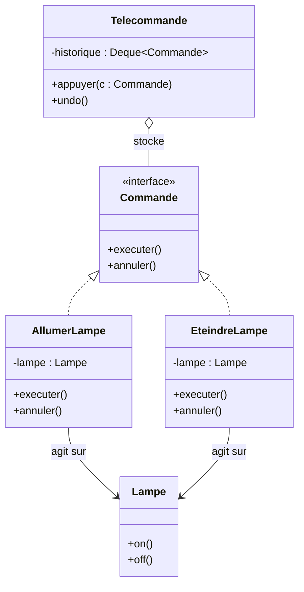
```mermaid
classDiagram
    class Telecommande {
        -historique : Deque~Commande~
        +appuyer(c : Commande)
        +undo()
    }
    class Commande {
        <<interface>>
        +executer()
        +annuler()
    }
    class AllumerLampe {
        -lampe : Lampe
        +executer()
        +annuler()
    }
    class EteindreLampe {
        -lampe : Lampe
        +executer()
        +annuler()
    }
    class Lampe {
        +on()
        +off()
    }
    Telecommande o-- Commande : stocke
    Commande <|.. AllumerLampe
    Commande <|.. EteindreLampe
    AllumerLampe --> Lampe : agit sur
    EteindreLampe --> Lampe : agit sur
```

🔎 **Lecture :** trois rôles, dans le sens des flèches. L'**invocateur** (`Telecommande`) ne sait rien faire lui-même : il appelle `executer()` et empile la commande pour pouvoir faire `undo()`. La **commande** (`AllumerLampe`) est l'action transformée en objet. Le **récepteur** (`Lampe`) fait le vrai travail.

```java
interface Commande { void executer(); void annuler(); }
class AllumerLampe implements Commande {
    public void executer() { lampe.on(); }
    public void annuler()  { lampe.off(); }
}
Deque<Commande> historique = new ArrayDeque<>();
```

### State ⭐
**But :** un objet change de comportement quand son état interne change (comme s'il changeait de classe).
**✅ Utiliser si :** machines à états (commande : créée → payée → expédiée), distributeur.
**❌ Éviter si :** l'objet n'a que 2-3 états avec peu de transitions : un `enum` + `switch` est plus simple.
**Diff. avec Strategy :** même structure UML ; en State, **les états se remplacent entre eux**, en Strategy **c'est le client qui choisit**.

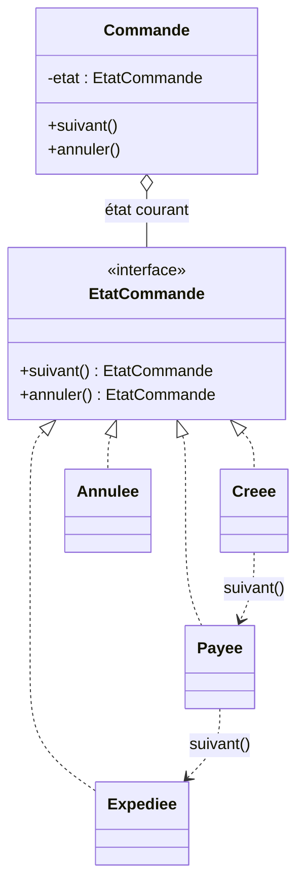
```mermaid
classDiagram
    class Commande {
        -etat : EtatCommande
        +suivant()
        +annuler()
    }
    class EtatCommande {
        <<interface>>
        +suivant() EtatCommande
        +annuler() EtatCommande
    }
    Commande o-- EtatCommande : état courant
    EtatCommande <|.. Creee
    EtatCommande <|.. Payee
    EtatCommande <|.. Expediee
    EtatCommande <|.. Annulee
    Creee ..> Payee : suivant()
    Payee ..> Expediee : suivant()
```

Les transitions, vues comme un automate :

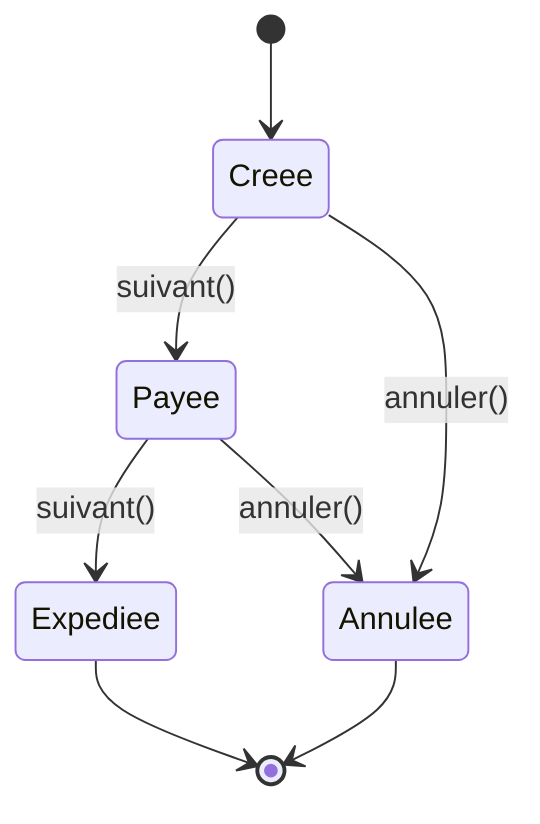
```mermaid
stateDiagram-v2
    [*] --> Creee
    Creee --> Payee : suivant()
    Payee --> Expediee : suivant()
    Creee --> Annulee : annuler()
    Payee --> Annulee : annuler()
    Expediee --> [*]
    Annulee --> [*]
```

🔎 **Lecture :** c'est la même forme que Strategy (◇ vers une interface), avec en plus les flèches **entre états** (`Creee ..> Payee`). C'est l'état lui-même qui choisit son successeur. `Commande.suivant()` fait simplement `etat = etat.suivant()`.

```java
class Commande {
    EtatCommande etat = new Creee();
    void suivant() { etat = etat.suivant(); }
}
```

### Template Method
**But :** définir le squelette d'un algorithme dans une classe mère, les sous-classes redéfinissent certaines étapes.
**✅ Utiliser si :** plusieurs classes suivent le même algorithme et ne diffèrent que sur quelques étapes.
**❌ Éviter si :** les variations sont nombreuses ou combinables : l'héritage devient rigide, préférer Strategy.
**Principe d'Hollywood :** « Ne nous appelez pas, on vous appellera. »

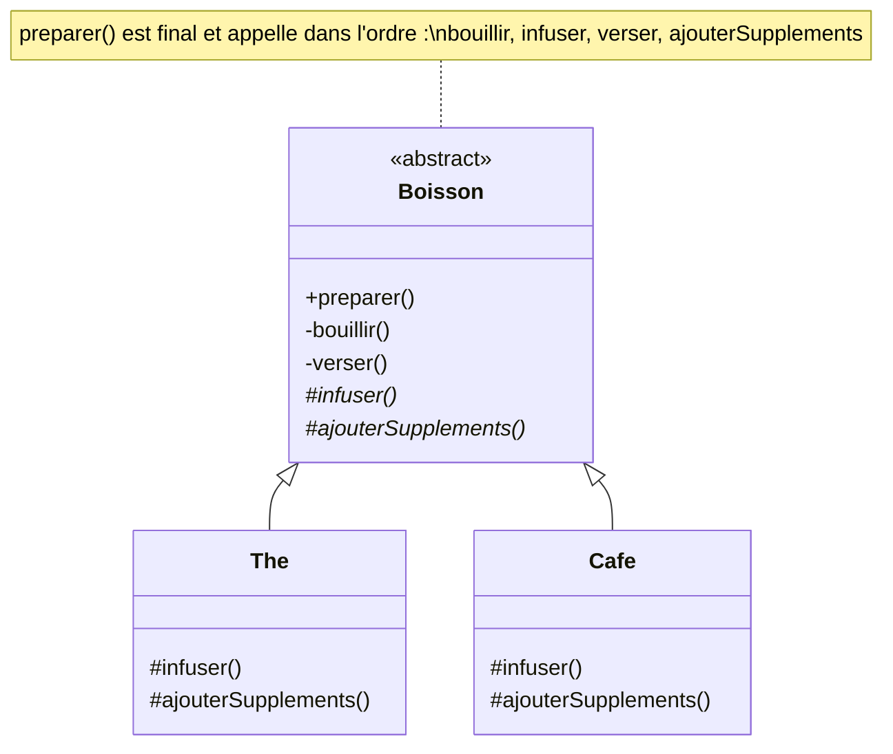
```mermaid
classDiagram
    class Boisson {
        <<abstract>>
        +preparer()
        -bouillir()
        -verser()
        #infuser()*
        #ajouterSupplements()*
    }
    class The {
        #infuser()
        #ajouterSupplements()
    }
    class Cafe {
        #infuser()
        #ajouterSupplements()
    }
    Boisson <|-- The
    Boisson <|-- Cafe
    note for Boisson "preparer() est final et appelle dans l'ordre :\nbouillir, infuser, verser, ajouterSupplements"
```

🔎 **Lecture :** dans la classe mère, les méthodes en *italique* sont **abstraites** : ce sont les « trous » que les sous-classes remplissent. Les méthodes privées (`bouillir`, `verser`) sont communes à tous. Les sous-classes **ne redéfinissent jamais** `preparer()` : c'est la mère qui garde le contrôle de l'ordre.

```java
abstract class Boisson {
    final void preparer() { bouillir(); infuser(); verser(); } // template
    abstract void infuser();                                   // étape variable
}
```

### Iterator
**But :** parcourir une collection sans exposer sa structure interne.
**✅ Utiliser si :** tu veux parcourir une structure (arbre, graphe, collection maison) sans exposer sa représentation interne.
**❌ Éviter si :** c'est une collection standard : utilise directement celles du langage (`for-each`, streams).
**Ex. Java :** `Iterator<T>`, boucle `for (x : collection)`.

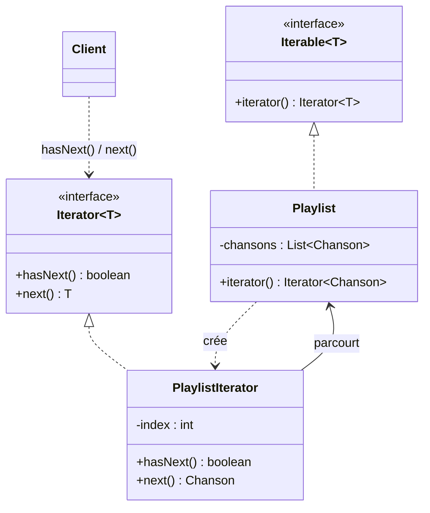
```mermaid
classDiagram
    class Iterable~T~ {
        <<interface>>
        +iterator() Iterator~T~
    }
    class Iterator~T~ {
        <<interface>>
        +hasNext() boolean
        +next() T
    }
    class Playlist {
        -chansons : List~Chanson~
        +iterator() Iterator~Chanson~
    }
    class PlaylistIterator {
        -index : int
        +hasNext() boolean
        +next() Chanson
    }
    class Client
    Iterable <|.. Playlist
    Iterator <|.. PlaylistIterator
    Playlist ..> PlaylistIterator : crée
    PlaylistIterator --> Playlist : parcourt
    Client ..> Iterator : hasNext() / next()
```

🔎 **Lecture :** la collection (`Playlist`) **fabrique** son itérateur, et c'est l'itérateur qui retient **où on en est** (`index`). Le client ne voit que `hasNext()` / `next()` : il ignore si les chansons sont dans une liste, un tableau ou un arbre. `for (Chanson c : playlist)` fait exactement ça en coulisse.

### Chain of Responsibility
**But :** faire passer une requête le long d'une chaîne de handlers jusqu'à ce que l'un la traite.
**✅ Utiliser si :** middlewares HTTP, filtres servlet, validation, support N1 → N2 → N3.
**❌ Éviter si :** chaque requête doit obligatoirement être traitée : rien ne garantit qu'un handler la prendra.

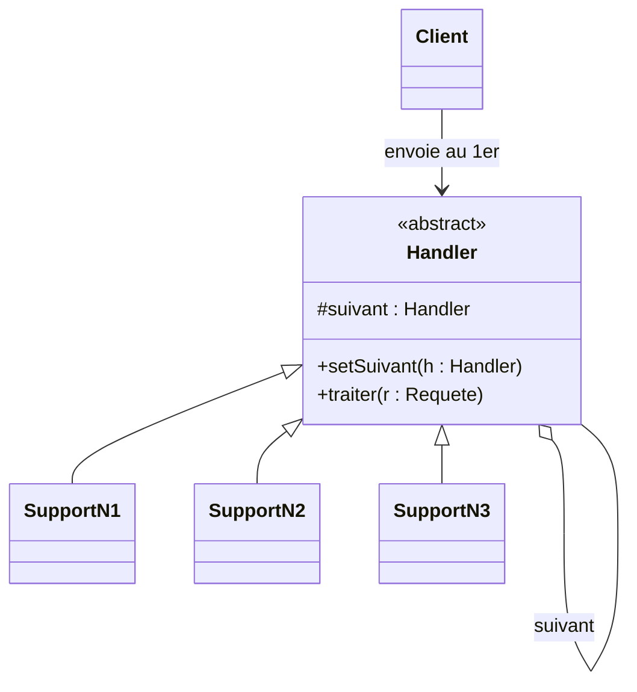
```mermaid
classDiagram
    class Client
    class Handler {
        <<abstract>>
        #suivant : Handler
        +setSuivant(h : Handler)
        +traiter(r : Requete)
    }
    Client --> Handler : envoie au 1er
    Handler o-- Handler : suivant
    Handler <|-- SupportN1
    Handler <|-- SupportN2
    Handler <|-- SupportN3
```

Ce que ça donne à l'exécution :

```mermaid
flowchart LR
    C[Client] --> N1[SupportN1]
    N1 -->|pas pour moi| N2[SupportN2]
    N2 -->|pas pour moi| N3[SupportN3]
    N1 -.->|je traite| R1((fin))
    N2 -.->|je traite| R2((fin))
    N3 -.->|je traite| R3((fin))
```

🔎 **Lecture :** le losange qui **boucle sur `Handler` lui-même** est la chaîne : chaque handler a un attribut `suivant` qui est aussi un `Handler`. Chacun décide soit de traiter la requête, soit de la passer au suivant.

```java
abstract class Handler {
    protected Handler suivant;
    void traiter(Requete r) { if (suivant != null) suivant.traiter(r); }
}
```

### Mediator
**But :** centraliser la communication entre objets pour qu'ils ne se connaissent pas directement.
**Image :** la tour de contrôle d'un aéroport.
**✅ Utiliser si :** composants d'un formulaire, chat room.
**❌ Éviter si :** il y a peu d'objets : le médiateur risque de devenir un « god object » plus complexe que le problème.

```mermaid
classDiagram
    class ChatRoom {
        <<interface>>
        +envoyer(msg : String, de : Utilisateur)
    }
    class ChatRoomImpl {
        -membres : List~Utilisateur~
        +envoyer(msg : String, de : Utilisateur)
    }
    class Utilisateur {
        -nom : String
        -chat : ChatRoom
        +ecrire(msg : String)
        +recevoir(msg : String)
    }
    ChatRoom <|.. ChatRoomImpl
    ChatRoomImpl "1" o-- "*" Utilisateur : redistribue
    Utilisateur --> ChatRoom : passe par
```

🔎 **Lecture :** remarque qu'il n'y a **aucune flèche `Utilisateur → Utilisateur`**. Chaque utilisateur ne connaît que la `ChatRoom`. `ecrire()` appelle `chat.envoyer()`, et c'est le médiateur qui appelle `recevoir()` sur tous les autres. Au lieu de N × N liens, on a N liens vers un hub.

### Memento
**But :** capturer et restaurer l'état d'un objet **sans violer l'encapsulation**.
**Acteurs :** Originator (crée/restaure), Memento (l'état), Caretaker (stocke l'historique).
**✅ Utiliser si :** undo, sauvegarde de partie.
**❌ Éviter si :** l'état est très volumineux ou change souvent : les snapshots coûtent cher en mémoire.

```mermaid
classDiagram
    class Editeur {
        -texte : String
        +ecrire(s : String)
        +sauvegarder() Snapshot
        +restaurer(s : Snapshot)
    }
    class Snapshot {
        -texte : String
        ~getTexte() String
    }
    class Historique {
        -pile : Deque~Snapshot~
        +push(s : Snapshot)
        +pop() Snapshot
    }
    Editeur ..> Snapshot : crée / relit
    Historique o-- Snapshot : stocke
    note for Editeur "Originator"
    note for Snapshot "Memento"
    note for Historique "Caretaker"
```

🔎 **Lecture :** `Editeur` (Originator) produit un `Snapshot` (Memento), une photo figée de son état. `Historique` (Caretaker) empile ces photos **sans jamais les ouvrir** : `getTexte()` n'est visible que dans le package (`~`), donc seul l'`Editeur` peut les relire. L'encapsulation est préservée.

### Visitor
**But :** ajouter une opération à une hiérarchie de classes **sans modifier ces classes**.
**Mécanisme :** double dispatch (`element.accept(visitor)` → `visitor.visit(this)`).
**✅ Utiliser si :** AST de compilateur, export (XML, JSON) d'une structure.
**❌ Éviter si :** la hiérarchie d'éléments change souvent : chaque nouveau type oblige à modifier tous les visiteurs.

```mermaid
classDiagram
    class Forme {
        <<interface>>
        +accept(v : Visiteur)
    }
    class Cercle {
        +accept(v : Visiteur)
    }
    class Carre {
        +accept(v : Visiteur)
    }
    class Visiteur {
        <<interface>>
        +visit(c : Cercle)
        +visit(c : Carre)
    }
    class ExportXML {
        +visit(c : Cercle)
        +visit(c : Carre)
    }
    class CalculAire {
        +visit(c : Cercle)
        +visit(c : Carre)
    }
    Forme <|.. Cercle
    Forme <|.. Carre
    Visiteur <|.. ExportXML
    Visiteur <|.. CalculAire
    Forme ..> Visiteur : accept(v)
```

🔎 **Lecture :** il y a deux hiérarchies. Les **éléments** (`Forme`) ne changent jamais. Les **opérations** (`Visiteur`) : 1 visiteur = 1 nouvelle opération. `Visiteur` a **une méthode `visit` par type d'élément**. `Cercle.accept(v)` fait `v.visit(this)`, et comme `this` est un `Cercle`, Java appelle la bonne surcharge : c'est le double dispatch.

```java
interface Visiteur { void visit(Cercle c); void visit(Carre c); }
class Cercle implements Forme {
    public void accept(Visiteur v) { v.visit(this); }
}
```

### Interpreter
**But :** définir une grammaire et un interpréteur pour un petit langage.
**✅ Utiliser si :** expressions régulières, calculatrice, règles métier simples. (Rare en pratique.)
**❌ Éviter si :** la grammaire est complexe : utilise plutôt un vrai parser (ANTLR, etc.).

```mermaid
classDiagram
    class Expression {
        <<interface>>
        +interpreter() int
    }
    class Nombre {
        -valeur : int
        +interpreter() int
    }
    class Addition {
        -gauche : Expression
        -droite : Expression
        +interpreter() int
    }
    class Multiplication {
        -gauche : Expression
        -droite : Expression
        +interpreter() int
    }
    Expression <|.. Nombre
    Expression <|.. Addition
    Expression <|.. Multiplication
    Addition "1" o-- "2" Expression
    Multiplication "1" o-- "2" Expression
```

🔎 **Lecture :** c'est un **Composite** appliqué à une grammaire. `Nombre` est la feuille, `Addition` et `Multiplication` contiennent 2 sous-expressions. `2 + 3 * 4` devient l'arbre `Addition(Nombre 2, Multiplication(Nombre 3, Nombre 4))`, et `interpreter()` descend récursivement dans cet arbre.

---

## 5. Bonus : MVC (pattern d'architecture)

MVC **n'est pas un des 23 patterns GoF** : c'est un pattern d'**architecture**, qui organise toute une application. Il est construit à partir de patterns GoF : **Observer** (le modèle prévient les vues), **Strategy** (la vue délègue au contrôleur, qu'on peut changer) et **Composite** (des vues imbriquées).

### MVC (Modèle – Vue – Contrôleur) ⭐
**But :** séparer une application en 3 rôles : le **Modèle** (données + règles métier), la **Vue** (affichage) et le **Contrôleur** (reçoit les actions de l'utilisateur et modifie le modèle).
**✅ Utiliser si :** application avec une interface graphique, où plusieurs vues affichent les mêmes données, ou quand on veut tester la logique métier sans l'IHM.
**❌ Éviter si :** petit script ou écran unique très simple : 3 rôles pour un bouton, c'est de la cérémonie pour rien.

Exemple du cours (Java AWT) : 3 boutons (10, 20, 30) changent une valeur, et 2 labels l'affichent, l'un en chiffres (`10`), l'autre en lettres (`dix`).

```mermaid
classDiagram
    class Application
    namespace Modele {
        class Model {
            -value : int = 7
            +setValue(v : int)
            +getValue() int
            +addModelListener(l : ModelListener)
            +removeModelListener(l : ModelListener)
            -fireNotify()
        }
        class ModelListener {
            <<interface>>
            +notify(m : Model)
        }
    }
    namespace Vue {
        class ViewLabelNum {
            +notify(m : Model)
        }
        class ViewLabelText {
            +notify(m : Model)
        }
    }
    namespace Controleur {
        class Controller10 {
            +actionPerformed(e : ActionEvent)
        }
        class Controller20 {
            +actionPerformed(e : ActionEvent)
        }
        class Controller30 {
            +actionPerformed(e : ActionEvent)
        }
    }
    namespace AWT {
        class Label {
            +setText(t : String)
        }
        class Button {
            +addActionListener(l : ActionListener)
        }
        class ActionListener {
            <<interface>>
            +actionPerformed(e : ActionEvent)
        }
    }
    Application *-- "-lblNum" Label
    Application *-- "-lblText" Label
    Application *-- "-btn10" Button
    Application *-- "-btn20" Button
    Application *-- "-btn30" Button
    Button "1" --> "*" ActionListener
    ActionListener <|.. Controller10
    ActionListener <|.. Controller20
    ActionListener <|.. Controller30
    Controller10 --> "-model" Model
    Controller20 --> "-model" Model
    Controller30 --> "-model" Model
    Model "1" --> "-modelListeners *" ModelListener
    ModelListener <|.. ViewLabelNum
    ModelListener <|.. ViewLabelText
    ViewLabelNum --> "-label" Label
    ViewLabelText --> "-label" Label
    note for Controller10 "actionPerformed : model.setValue(10)"
    note for ViewLabelNum "notify : label.setText(Integer.toString(m.getValue()))"
    note for ViewLabelText "notify : switch sur m.getValue() : dix, vingt, trente ou ?"
```

🔎 **Lecture :** il y a **deux Observer** dans ce diagramme. Côté AWT, `Button → ActionListener` : le bouton prévient ses contrôleurs quand on clique. Côté métier, `Model → ModelListener` : le modèle prévient ses vues quand la valeur change. Entre les deux, le **contrôleur** fait le lien : `actionPerformed()` appelle `model.setValue(10)`. `Model` ne connaît que l'interface `ModelListener` : ni les vues, ni les labels, ni les boutons. On peut donc ajouter une vue ou un contrôleur **sans modifier `Model`**. `Application` crée et possède (◆) les composants graphiques, puis branche tout.

Ce qui se passe quand on clique sur « 10 » :

```mermaid
sequenceDiagram
    actor U as Utilisateur
    participant B as btn10 : Button
    participant C as Controller10
    participant M as Model
    participant VN as ViewLabelNum
    participant VT as ViewLabelText
    participant LN as lblNum : Label
    participant LT as lblText : Label
    U->>B: clic
    B->>C: actionPerformed(e)
    C->>M: setValue(10)
    M->>M: fireNotify()
    M->>VN: notify(this)
    VN->>M: getValue()
    M-->>VN: 10
    VN->>LN: setText("10")
    M->>VT: notify(this)
    VT->>M: getValue()
    M-->>VT: 10
    VT->>LT: setText("dix")
```

| Rôle | Classes | Fait | Ne fait **jamais** |
|---|---|---|---|
| **Modèle** | `Model`, `ModelListener` | stocke la valeur, notifie ses listeners | afficher, connaître une vue concrète |
| **Vue** | `ViewLabelNum`, `ViewLabelText` | relit le modèle et met à jour son `Label` | modifier le modèle |
| **Contrôleur** | `Controller10/20/30` | reçoit le clic, appelle `model.setValue()` | afficher, stocker la valeur |
| *Assemblage* | `Application` | crée les composants et branche les listeners | contenir de la logique métier |

```java
interface ModelListener { void notify(Model m); }

class Model {                                            // MODÈLE
    private int value = 7;
    private final List<ModelListener> modelListeners = new ArrayList<>();
    public void addModelListener(ModelListener l)    { modelListeners.add(l); }
    public void removeModelListener(ModelListener l) { modelListeners.remove(l); }
    public int getValue() { return value; }
    public void setValue(int v) { value = v; fireNotify(); }
    private void fireNotify() { for (ModelListener l : modelListeners) l.notify(this); }
}

class ViewLabelNum implements ModelListener {            // VUE
    private final Label label;
    ViewLabelNum(Label label) { this.label = label; }
    public void notify(Model m) { label.setText(Integer.toString(m.getValue())); }
}

class ViewLabelText implements ModelListener {           // VUE
    private final Label label;
    ViewLabelText(Label label) { this.label = label; }
    public void notify(Model m) {
        switch (m.getValue()) {
            case 10 -> label.setText("dix");
            case 20 -> label.setText("vingt");
            case 30 -> label.setText("trente");
            default -> label.setText("?");
        }
    }
}

class Controller10 implements ActionListener {           // CONTRÔLEUR
    private final Model model;
    Controller10(Model model) { this.model = model; }
    public void actionPerformed(ActionEvent e) { model.setValue(10); }
}

// Dans Application : on branche tout
Model model = new Model();
model.addModelListener(new ViewLabelNum(lblNum));
model.addModelListener(new ViewLabelText(lblText));
btn10.addActionListener(new Controller10(model));
btn20.addActionListener(new Controller20(model));
btn30.addActionListener(new Controller30(model));
```

**Variantes à connaître :**
- **MVC web** (Spring MVC, Symfony, Laravel) : pas d'Observer. Le contrôleur reçoit la requête HTTP, appelle le modèle, puis passe les données à la vue (un template HTML).
- **MVP** : la vue est passive, c'est le *Presenter* qui la met à jour.
- **MVVM** (Angular, Vue.js, WPF) : la vue est liée au *ViewModel* par **data binding**, et les mises à jour sont automatiques dans les deux sens.

---

## 6. Exercice de révision : interrupteur ON / OFF

**Énoncé :** on a un noyau fonctionnel `NoyauFonctionnel` (`+allumer()`, `+eteindre()`). L'IHM a un label `lblStatus` (« Éteint » / « Allumé ») et deux boutons `btnON` et `btnOFF`. Un bouton est **grisé** quand son action est impossible.

**Diagramme d'états et matrice** (point de départ du diagramme de classes) :

| État \ Événement | `CON` (clic ON) | `COFF` (clic OFF) |
|---|---|---|
| **Éteint** | → Allumé : `nf.allumer()`, `display("Allumé")` | ✗ |
| **Allumé** | ✗ | → Éteint : `nf.eteindre()`, `display("Éteint")` |

*Init :* → Éteint, `nf.eteindre()`, `display("Éteint")`.

> **Le lien avec les boutons :** une case ✗ = événement impossible dans cet état = **bouton grisé**. C'est exactement ce que calculent `isONEnabled()` et `isOFFEnabled()` dans le modèle.

### ON/OFF : MVC + Observer + Command
**But :** traduire l'énoncé en MVC : le `Model` enveloppe le noyau fonctionnel, 3 vues se mettent à jour toutes seules (Observer), et chaque bouton déclenche une `Command`.

```mermaid
stateDiagram-v2
    state "Éteint" as Eteint
    state "Allumé" as Allume
    [*] --> Eteint : init / nf.eteindre(), display("Éteint")
    Eteint --> Allume : CON / nf.allumer(), display("Allumé")
    Allume --> Eteint : COFF / nf.eteindre(), display("Éteint")
```

```mermaid
classDiagram
    class Application
    namespace Noyau {
        class NoyauFonctionnel {
            +allumer()
            +eteindre()
        }
    }
    namespace Modele {
        class Model {
            -allume : boolean
            -textToDisplay : String
            +allumer()
            +eteindre()
            +getTextToDisplay() String
            +isONEnabled() boolean
            +isOFFEnabled() boolean
            +addModelListener(l : ModelListener)
            -fireNotify()
        }
        class ModelListener {
            <<interface>>
            +notify(m : Model)
        }
    }
    namespace Vue {
        class LabelView {
            +notify(m : Model)
        }
        class ONEnabling {
            +notify(m : Model)
        }
        class OFFEnabling {
            +notify(m : Model)
        }
    }
    namespace Controleur {
        class CtrlON {
            +onClick()
        }
        class CtrlOFF {
            +onClick()
        }
    }
    namespace Commande {
        class Command {
            <<interface>>
            +execute()
        }
        class CommandAllumer {
            +execute()
        }
        class CommandEteindre {
            +execute()
        }
    }
    namespace AWT {
        class Label {
            +setText(t : String)
        }
        class Button {
            +setEnabled(b : boolean)
            +addActionListener(l : ActionListener)
        }
        class ActionListener {
            <<interface>>
            +onClick()
        }
    }
    Application *-- "-lblStatus" Label
    Application *-- "-btnON" Button
    Application *-- "-btnOFF" Button
    Application --> "-model" Model
    Model --> "-nf" NoyauFonctionnel
    Model "1" --> "-modelListeners *" ModelListener
    ModelListener <|.. LabelView
    ModelListener <|.. ONEnabling
    ModelListener <|.. OFFEnabling
    LabelView --> "-label" Label
    ONEnabling --> "-btn" Button
    OFFEnabling --> "-btn" Button
    Button "1" --> "*" ActionListener
    ActionListener <|.. CtrlON
    ActionListener <|.. CtrlOFF
    CtrlON --> "-command" Command
    CtrlOFF --> "-command" Command
    Command <|.. CommandAllumer
    Command <|.. CommandEteindre
    CommandAllumer --> "-model" Model
    CommandEteindre --> "-model" Model
```

🔎 **Lecture :** c'est le MVC du cours avec **Observer deux fois** et **Command** en plus. Observer n°1 : `Button → ActionListener`, le bouton prévient son contrôleur. Observer n°2 : `Model → ModelListener`, le modèle prévient ses 3 vues. Command : `CtrlON` ne sait pas ce qu'il déclenche, il appelle juste `command.execute()`. Les rôles du pattern Command sont : **invocateur** = `CtrlON` / `CtrlOFF`, **commande** = `CommandAllumer` / `CommandEteindre`, **récepteur** = `Model`. Le `Model` enveloppe le `NoyauFonctionnel` et ajoute ce dont l'IHM a besoin : le texte à afficher et les boutons actifs. Les vues ne font que **lire** le modèle : `LabelView` affiche le texte, `ONEnabling` et `OFFEnabling` grisent les boutons.

Ce qui se passe quand on clique sur ON :

```mermaid
sequenceDiagram
    actor U as Utilisateur
    participant B as btnON : Button
    participant C as CtrlON
    participant K as CommandAllumer
    participant M as Model
    participant NF as NoyauFonctionnel
    participant LV as LabelView
    participant EN as ONEnabling
    U->>B: clic
    B->>C: onClick()
    C->>K: execute()
    K->>M: allumer()
    M->>NF: allumer()
    M->>M: allume = true, textToDisplay = "Allumé"
    M->>M: fireNotify()
    M->>LV: notify(this)
    LV->>M: getTextToDisplay()
    M-->>LV: "Allumé"
    Note right of LV: lblStatus.setText("Allumé")
    M->>EN: notify(this)
    EN->>M: isONEnabled()
    M-->>EN: false
    EN->>B: setEnabled(false)
    Note over M,EN: OFFEnabling fait pareil : btnOFF.setEnabled(true)
```

**Méthode pour refaire ce diagramme à l'exam :**
1. **Modèle :** une classe `Model` qui enveloppe le noyau (`-nf`) et ajoute **un getter par info affichée** (`getTextToDisplay()`) et **un `isXEnabled()` par bouton**. Une transition du diagramme d'états = une méthode du `Model` (`allumer()`, `eteindre()`).
2. **Observer côté modèle :** une interface `ModelListener` avec `notify(m : Model)`, et **une vue par élément graphique à mettre à jour** (`LabelView`, `ONEnabling`, `OFFEnabling`), chacune avec un lien vers son composant.
3. **Contrôleurs :** un `ActionListener` par bouton (`CtrlON`, `CtrlOFF`).
4. **Command :** une interface `Command` avec `execute()`, et une commande par action du noyau (`CommandAllumer`, `CommandEteindre`), chacune avec un `-model`.
5. **Application :** ◆ vers les composants graphiques, puis elle crée et branche tout.

```java
class Model {                                            // MODÈLE
    private final NoyauFonctionnel nf;
    private final List<ModelListener> modelListeners = new ArrayList<>();
    private boolean allume;
    private String textToDisplay;

    Model(NoyauFonctionnel nf) { this.nf = nf; nf.eteindre(); textToDisplay = "Éteint"; } // Init
    public void allumer()  { nf.allumer();  allume = true;  textToDisplay = "Allumé"; fireNotify(); }
    public void eteindre() { nf.eteindre(); allume = false; textToDisplay = "Éteint"; fireNotify(); }
    public String getTextToDisplay() { return textToDisplay; }
    public boolean isONEnabled()  { return !allume; }    // case ✗ de la matrice → bouton grisé
    public boolean isOFFEnabled() { return allume; }
    public void addModelListener(ModelListener l) { modelListeners.add(l); l.notify(this); } // affichage initial
    private void fireNotify() { for (ModelListener l : modelListeners) l.notify(this); }
}

class LabelView implements ModelListener {               // VUE
    private final Label label;
    LabelView(Label label) { this.label = label; }
    public void notify(Model m) { label.setText(m.getTextToDisplay()); }
}
class ONEnabling implements ModelListener {              // VUE (OFFEnabling : pareil avec isOFFEnabled)
    private final Button btn;
    ONEnabling(Button btn) { this.btn = btn; }
    public void notify(Model m) { btn.setEnabled(m.isONEnabled()); }
}

interface Command { void execute(); }
class CommandAllumer implements Command {                // COMMANDE
    private final Model model;
    CommandAllumer(Model model) { this.model = model; }
    public void execute() { model.allumer(); }
}
class CtrlON implements ActionListener {                 // CONTRÔLEUR = invocateur
    private final Command command;
    CtrlON(Command command) { this.command = command; }
    public void onClick() { command.execute(); }
}

// Dans Application : on branche tout
Model model = new Model(new NoyauFonctionnel());
model.addModelListener(new LabelView(lblStatus));
model.addModelListener(new ONEnabling(btnON));
model.addModelListener(new OFFEnabling(btnOFF));
btnON.addActionListener(new CtrlON(new CommandAllumer(model)));
btnOFF.addActionListener(new CtrlOFF(new CommandEteindre(model)));
```

> `-allume : boolean` n'est pas sur le schéma du prof, mais il faut bien mémoriser l'état quelque part. C'est justement ce que la version State ci-dessous remplace. Dans le vrai AWT, `onClick()` s'appelle `actionPerformed(ActionEvent e)`.

### ON/OFF : version State
**But :** remplacer le booléen `allume` et les `if` du `Model` par le **pattern State** : chaque état du diagramme d'états devient une classe.

```mermaid
classDiagram
    class Model {
        -textToDisplay : String
        +allumer()
        +eteindre()
        +getTextToDisplay() String
        +isONEnabled() boolean
        +isOFFEnabled() boolean
        ~setEtat(e : Etat)
        ~setText(t : String)
        ~getNf() NoyauFonctionnel
    }
    class Etat {
        <<interface>>
        +allumer(m : Model)
        +eteindre(m : Model)
        +isONEnabled() boolean
        +isOFFEnabled() boolean
    }
    class EtatEteint {
        +INSTANCE : EtatEteint$
        -EtatEteint()
        +allumer(m : Model)
        +eteindre(m : Model)
        +isONEnabled() boolean
        +isOFFEnabled() boolean
    }
    class EtatAllume {
        +INSTANCE : EtatAllume$
        -EtatAllume()
        +allumer(m : Model)
        +eteindre(m : Model)
        +isONEnabled() boolean
        +isOFFEnabled() boolean
    }
    class NoyauFonctionnel {
        +allumer()
        +eteindre()
    }
    Model --> "-etat" Etat
    Model --> "-nf" NoyauFonctionnel
    Etat <|.. EtatEteint
    Etat <|.. EtatAllume
    EtatEteint ..> EtatAllume : allumer()
    EtatAllume ..> EtatEteint : eteindre()
```

🔎 **Lecture :** on passe du diagramme d'états au diagramme de classes **mécaniquement**. Chaque **état** devient une classe (`EtatEteint`, `EtatAllume`), chaque **événement** devient une méthode de l'interface `Etat` (`allumer`, `eteindre`), et chaque **case de la matrice** devient le corps d'une méthode. Une case avec action : on fait l'action, puis `m.setEtat(...)` vers l'état suivant. Une case ✗ : méthode vide, et le `isXEnabled()` correspondant renvoie `false`. `Model.allumer()` se contente de déléguer (`etat.allumer(this)`) : plus aucun `if`. Les états n'ont pas d'attributs, donc une seule instance suffit : c'est un **Singleton** (`EtatAllume.INSTANCE`, constructeur privé). Les vues, contrôleurs, commandes et `Application` ne changent pas.

```java
interface Etat {
    void allumer(Model m);
    void eteindre(Model m);
    boolean isONEnabled();
    boolean isOFFEnabled();
}

class EtatEteint implements Etat {
    public static final EtatEteint INSTANCE = new EtatEteint();   // Singleton
    private EtatEteint() {}
    public void allumer(Model m) {                               // case (Éteint, CON)
        m.getNf().allumer();
        m.setText("Allumé");
        m.setEtat(EtatAllume.INSTANCE);
    }
    public void eteindre(Model m) { }                            // case ✗ : rien à faire
    public boolean isONEnabled()  { return true; }
    public boolean isOFFEnabled() { return false; }
}

class EtatAllume implements Etat {
    public static final EtatAllume INSTANCE = new EtatAllume();
    private EtatAllume() {}
    public void allumer(Model m) { }                             // case ✗
    public void eteindre(Model m) {                              // case (Allumé, COFF)
        m.getNf().eteindre();
        m.setText("Éteint");
        m.setEtat(EtatEteint.INSTANCE);
    }
    public boolean isONEnabled()  { return false; }
    public boolean isOFFEnabled() { return true; }
}

class Model {
    private final NoyauFonctionnel nf;
    private Etat etat = EtatEteint.INSTANCE;                     // Init
    private String textToDisplay = "Éteint";
    // (+ modelListeners, addModelListener, fireNotify : comme avant)
    Model(NoyauFonctionnel nf) { this.nf = nf; nf.eteindre(); }
    public void allumer()  { etat.allumer(this);  fireNotify(); }  // délègue à l'état courant
    public void eteindre() { etat.eteindre(this); fireNotify(); }
    public boolean isONEnabled()  { return etat.isONEnabled(); }
    public boolean isOFFEnabled() { return etat.isOFFEnabled(); }
    public String getTextToDisplay() { return textToDisplay; }
    void setEtat(Etat e) { etat = e; }
    void setText(String t) { textToDisplay = t; }
    NoyauFonctionnel getNf() { return nf; }
}
```

---

## 7. Les confusions classiques

| Patterns | Point commun | Différence |
|---|---|---|
| Strategy vs State | Même diagramme (contexte + interface) | Strategy : choisi par le client. State : transitions internes |
| Decorator vs Proxy | Wrappe un objet de même interface | Decorator : ajoute du comportement. Proxy : contrôle l'accès |
| Decorator vs Composite | Composition récursive | Decorator : 1 enfant, ajoute des responsabilités. Composite : N enfants, agrège |
| Adapter vs Facade | Wrappent quelque chose | Adapter : **change** une interface. Facade : **simplifie** un sous-système |
| Adapter vs Bridge | Découplent interface / implémentation | Adapter : après coup (legacy). Bridge : prévu dès la conception |
| Factory Method vs Abstract Factory | Délèguent la création | Méthode (héritage, 1 produit) vs objet (composition, famille de produits) |
| Template Method vs Strategy | Font varier un algorithme | Template : **héritage**, varie une étape. Strategy : **composition**, varie tout l'algo |
| Observer vs Mediator | Découplent les objets | Observer : diffusion 1 → N. Mediator : hub central N ↔ N |
| Observer vs MVC | Le modèle prévient les vues | Observer : **une brique** (1 sujet → N abonnés). MVC : **une architecture** complète qui utilise Observer entre modèle et vues |

---

## 8. Quel pattern pour quel problème ?

| J'ai besoin de… | Pattern |
|---|---|
| Une seule instance | Singleton |
| Créer un objet sans connaître sa classe exacte | Factory Method |
| Créer une famille d'objets cohérents | Abstract Factory |
| Construire un objet avec plein d'options | Builder |
| Copier un objet existant | Prototype |
| Brancher une classe qui n'a pas la bonne interface | Adapter |
| Simplifier l'usage d'une lib complexe | Facade |
| Ajouter des options cumulables à la volée | Decorator |
| Représenter une arborescence | Composite |
| Charger paresseusement / contrôler l'accès | Proxy |
| Économiser la mémoire sur des milliers d'objets similaires | Flyweight |
| Éviter l'explosion de sous-classes sur 2 dimensions | Bridge |
| Changer d'algorithme à l'exécution | Strategy |
| Prévenir plusieurs objets d'un changement | Observer |
| Undo / redo, file d'actions | Command (+ Memento) |
| Comportement qui dépend de l'état | State |
| Même algo, étapes variables | Template Method |
| Passer une requête à une suite de handlers | Chain of Responsibility |
| Ajouter des opérations sans toucher aux classes | Visitor |
| Sauvegarder / restaurer un état | Memento |
| Parcourir une collection | Iterator |
| Réduire les dépendances entre N composants | Mediator |
| Séparer données, affichage et gestion des actions utilisateur | MVC (architecture) |

---

## 9. Rappel SOLID (ce que les patterns servent à respecter)

| Lettre | Principe | Patterns typiques |
|---|---|---|
| **S** – Single Responsibility | Une classe = une raison de changer | Command, Facade |
| **O** – Open/Closed | Ouvert à l'extension, fermé à la modification | Strategy, Decorator, Observer, Visitor |
| **L** – Liskov Substitution | Une sous-classe doit pouvoir remplacer sa mère | Template Method (bien fait) |
| **I** – Interface Segregation | Plusieurs petites interfaces > une grosse | Adapter |
| **D** – Dependency Inversion | Dépendre d'abstractions, pas de classes concrètes | Factory, Abstract Factory, Strategy |
