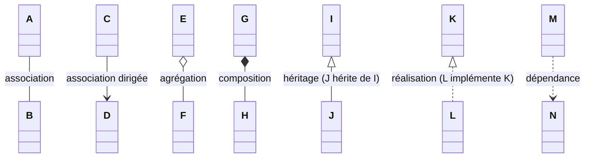

# Cheat sheet UML – Diagrammes de classes

## 1. Les connecteurs (relations)

| Relation | Notation | Sens | Exemple |
|---|---|---|---|
| Association | `A ────── B` (trait plein) | A et B sont liés | Client ── Compte |
| Association dirigée | `A ─────> B` (flèche ouverte) | A connaît B, B ne connaît pas A | Client ──> ATM |
| Agrégation | `A ◇───── B` (losange vide côté A) | A a des B, mais B peut vivre sans A | Équipe ◇── Joueur |
| Composition | `A ◆───── B` (losange plein côté A) | A possède B, B meurt avec A | Maison ◆── Pièce |
| Héritage / généralisation | `A ─────▷ B` (triangle vide vers le parent) | A **est un** B | CompteCourant ──▷ Compte |
| Réalisation / implémentation | `A - - - -▷ B` (pointillé + triangle vide) | A implémente l'interface B | ArrayList - -▷ List |
| Dépendance | `A - - - -> B` (pointillé + flèche ouverte) | A utilise B ponctuellement (paramètre, variable locale) | Service - -> Logger |

**Du plus faible au plus fort couplage :**
Dépendance < Association < Agrégation < Composition < Héritage

### Même chose en Mermaid (rendu sur GitHub, GitLab, Obsidian…)



---

## 2. Les losanges

Le losange se met **toujours du côté du "tout"** (le conteneur), jamais du côté de la partie.

- **Losange vide = agrégation** → relation "a un" faible.
  La partie existe indépendamment et peut être partagée.
  *Ex : une Équipe a des Joueurs. Si l'équipe est dissoute, les joueurs existent toujours.*
- **Losange plein = composition** → relation "est composé de" forte.
  La partie n'existe pas sans le tout, et appartient à un seul tout.
  *Ex : une Maison est composée de Pièces. Si tu détruis la maison, les pièces disparaissent.*

> Mnémo : **plein = fort = lié à vie**

### En code (Java)

```java
// Composition : Maison crée et possède ses pièces
class Maison {
    private List<Piece> pieces = new ArrayList<>();
    Maison() { pieces.add(new Piece("salon")); }
}

// Agrégation : les joueurs viennent de l'extérieur
class Equipe {
    private List<Joueur> joueurs;
    Equipe(List<Joueur> joueurs) { this.joueurs = joueurs; }
}
```

---

## 3. La boîte de classe

```
┌─────────────────────────────┐
│        NomDeClasse          │  ← nom (italique si abstraite)
├─────────────────────────────┤
│ - attribut : Type = défaut  │  ← attributs
│ + attributStatique : int    │    (souligné si static)
├─────────────────────────────┤
│ + methode(p : Type) : Retour│  ← opérations
└─────────────────────────────┘
```

### Visibilité

| Symbole | Sens |
|---|---|
| `+` | public |
| `-` | private |
| `#` | protected |
| `~` | package |

### Stéréotypes et mots-clés utiles

- `<<interface>>` : interface (reliée par une réalisation en pointillé)
- `<<abstract>>`, `{abstract}` ou nom en *italique* : classe abstraite
- `<<enumeration>>` : énumération
- Nom de rôle au bout d'une association (`-titulaire`), nom de l'association au milieu (`Has`)

---

## 4. Multiplicités (cardinalités)

| Notation | Sens |
|---|---|
| `1` | exactement un |
| `0..1` | zéro ou un (optionnel) |
| `*` ou `0..*` | zéro ou plusieurs |
| `1..*` | au moins un |
| `2..5` | entre 2 et 5 |

### Sens de lecture

**Le chiffre placé à côté d'une classe dit combien d'instances de cette classe sont liées à UNE instance de l'autre classe.**

```
Customer 1 ─────── 1..2 Account
```

- Le `1..2` est collé à `Account` → **un customer a 1 ou 2 comptes**
- Le `1` est collé à `Customer` → **un compte appartient à 1 seul customer**

> Astuce : pars de la classe d'en face.
> "Un [classe d'en face] a [chiffre près de moi] [moi]."

Autre exemple :

```
Account 1 ─────── * ATMTransaction
```

- Un compte a plusieurs transactions (`*` côté transaction)
- Une transaction concerne un seul compte (`1` côté compte)

> ⚠️ `1,2` n'est pas très standard, en UML propre on écrit `1..2`.

---

## 5. Exemple : lecture du diagramme Bank / ATM

- `Bank ◇── ATM` : agrégation. La banque gère des distributeurs, mais un ATM reste un objet à part entière.
- `Bank ◇── Account` : agrégation. Discutable : une composition serait plus juste, un compte n'existe pas sans banque.
- `Customer 1 ── 1..2 Account` ("Has") : un client a 1 ou 2 comptes, un compte appartient à 1 client.
- `Customer ──> ATM` : association dirigée, le client connaît l'ATM, pas l'inverse.
- `Account 1 ── * ATM Transactions` : un compte a plusieurs transactions.
- `Current Account ──▷ Account` et `Saving Account ──▷ Account` : héritage.
  Détail : les sous-classes répètent `account no.` et `balance`, inutile puisque c'est hérité.
- `Current Account 1 ── 1 Saving Account` ("Savings-Checking") : association simple 1–1.

---

## 6. Rappel global UML

**UML** (Unified Modeling Language) = 14 types de diagrammes, en deux familles :

**Structurels** (le "quoi")
- Classes
- Objets
- Composants
- Déploiement
- Paquetages
- Structure composite
- Profils

**Comportementaux** (le "comment")
- Cas d'utilisation
- Activité
- États-transitions
- Interaction :
  - Séquence
  - Communication
  - Timing
  - Vue d'ensemble des interactions

> Les 3 qui reviennent le plus (cours, exams, entretiens) : **classes**, **séquence**, **cas d'utilisation**.
